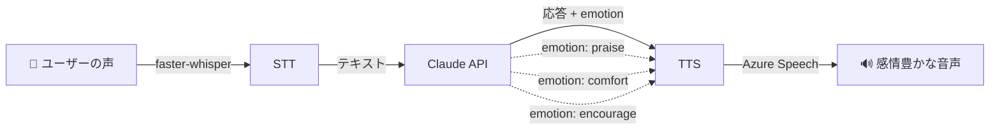

## はじめに

こんにちは！ミミだよ〜✨

突然だけど、AI英会話って **声が棒読み** だと萎えない？

「Great job!」って褒めてくれても、ロボットみたいな平坦な声だと全然嬉しくないんだよね。逆に「It's okay, don't worry」って慰めてくれるとき、やさしい声で言ってくれたらグッとくるのに…。

そこでミミは思ったの。**感情を込めた声で英語を教えてくれるAI** を作りたい！って。

結論から言うと、**Azure Speech Service の無料枠** を使えば、感情豊かなTTSが **月50万文字まで無料** で使えちゃう。しかも実装はめちゃくちゃシンプル。今日はその作り方を紹介するね！

## TTSサービス比較 — どれを使う？

AI英会話のTTSを選ぶにあたって、3つのサービスを比較したよ：

| | Edge TTS | Azure Speech Service | ElevenLabs |
|---|---|---|---|
| **コスト** | 無料（非公式API※） | **50万文字/月 無料** | 1万文字/月（無料枠） |
| **感情スタイル** | ❌ なし | ✅ **10種類以上（SSML）** | ✅ あり（独自API） |
| **SSML対応** | prosodyのみ | ✅ express-as, prosody | ❌（独自形式） |
| **声の自然さ** | ⭐⭐⭐ | ⭐⭐⭐⭐ | ⭐⭐⭐⭐⭐ |
| **レイテンシ** | 速い | 速い | やや遅い |
| **Python SDK** | 非公式 | ✅ 公式SDK | ✅ 公式SDK |
| **ピッチ/速度調整** | ❌ | ✅ prosody要素 | ❌ |

※ Edge TTS は `edge-tts` パッケージ経由で Microsoft Edge ブラウザの内部 TTS エンドポイントを利用します。公式 API ではないため、突然の仕様変更・停止のリスクがある点に注意してね。

Edge TTS は手軽だけど感情がない。ElevenLabs は声の自然さはピカイチだけど無料枠が少なすぎる。

**Azure Speech は感情スタイル対応で50万文字/月無料**。英会話の練習なら使い切れない量だよ。これしかない！🔥

## Azure Speech の無料枠が最強

[Azure Speech Service の料金ページ](https://azure.microsoft.com/ja-jp/pricing/details/cognitive-services/speech-services/) によると、Free Tier（F0）はこんな感じ：

- **TTS**: 50万文字/月（[公式料金ページ](https://azure.microsoft.com/en-us/pricing/details/cognitive-services/speech-services/) / [制限値の詳細](https://learn.microsoft.com/en-us/azure/ai-services/speech-service/speech-services-quotas-and-limits)）
- **STT**: 音声認識も無料枠あり（詳細は[公式料金ページ](https://azure.microsoft.com/en-us/pricing/details/cognitive-services/speech-services/)を確認）
- **Neural Voice**: 対応（高品質な音声合成）
- **SSML**: 完全対応（感情・ピッチ・速度すべて制御可能）

> 参考: [Azure AI Speech の価格](https://azure.microsoft.com/en-us/pricing/details/cognitive-services/speech-services/) — 2026年3月時点の情報です。最新の無料枠は公式ページを確認してね。

1日あたり約1.6万文字。英会話レッスンで1回の発話が50文字だとして、**1日約330回発話できる**。毎日1時間レッスンしても余裕だね😊

セットアップは [Azure Portal](https://portal.azure.com/) で「Speech Service」リソースを作るだけ。リージョンは `japanwest`（大阪）を選ぶとレイテンシが低くていい感じ。

## 実装 — Azure Speech SDK + SSML で感情表現

### SSMLの書き方

Azure Speech の感情表現は、SSML の `mstts:express-as` 要素で指定するよ。こんな感じ：

```xml
<speak version="1.0"
  xmlns="http://www.w3.org/2001/10/synthesis"
  xmlns:mstts="https://www.w3.org/2001/mstts"
  xml:lang="en-US">
  <voice name="en-US-JaneNeural">
    <mstts:express-as style="excited" styledegree="1.5">
      <prosody pitch="+15%" rate="-5%">
        Yes! That was amazing! I'm so proud of you!
      </prosody>
    </mstts:express-as>
  </voice>
</speak>
```

ポイントは3つ：

1. **`style`** — 感情の種類（`excited`, `friendly`, `whispering` など）
2. **`styledegree`** — 感情の強さ（0.01〜2.0、デフォルト1.0）
3. **`prosody`** — ピッチと速度の微調整

`styledegree="1.5"` にすると感情がちょっと強めに出て、キャラクター感が出るんだよね。かわいい💕

### Pythonコード — SSML構築と音声生成

実際のコードはこんな感じ：

```python
import azure.cognitiveservices.speech as speechsdk

VOICE = "en-US-JaneNeural"

# 感情スタイルのマッピング
STYLES = {
    "default": "friendly",
    "encourage": "hopeful",
    "praise": "excited",
    "comfort": "friendly",
    "flirt": "whispering",
}


def _build_ssml(text: str, style: str = "default") -> str:
    """Build SSML with mstts:express-as for emotional speech."""
    style_name = STYLES.get(style, STYLES["default"])
    return (
        '<speak version="1.0" xmlns="http://www.w3.org/2001/10/synthesis" '
        'xmlns:mstts="https://www.w3.org/2001/mstts" xml:lang="en-US">'
        f'<voice name="{VOICE}">'
        f'<mstts:express-as style="{style_name}" styledegree="1.5">'
        f'<prosody pitch="+15%" rate="-5%">'
        f'{text}'
        '</prosody>'
        '</mstts:express-as>'
        '</voice>'
        '</speak>'
    )


def _generate(text: str, output_path: str, style: str = "default") -> None:
    """Generate speech audio with Azure Speech Service."""
    config = speechsdk.SpeechConfig(
        subscription="YOUR_AZURE_KEY",
        region="japanwest"
    )
    config.set_speech_synthesis_output_format(
        speechsdk.SpeechSynthesisOutputFormat.Audio16Khz32KBitRateMonoMp3
    )

    audio_config = speechsdk.audio.AudioOutputConfig(filename=output_path)
    synthesizer = speechsdk.SpeechSynthesizer(
        speech_config=config, audio_config=audio_config
    )

    ssml = _build_ssml(text, style)
    result = synthesizer.speak_ssml_async(ssml).get()

    if result.reason == speechsdk.ResultReason.Canceled:
        details = result.cancellation_details
        raise RuntimeError(f"TTS failed: {details.reason} - {details.error_details}")
```

`speak_ssml_async` で非同期にSSMLを送信して、音声ファイルを生成するよ。出力フォーマットは `Audio16Khz32KBitRateMonoMp3` を使ってるけど、用途に応じて WAV にもできるよ。

### 感情自動判定 — テキストから感情を推測

LLMからの応答テキストを見て、自動的に感情スタイルを選ぶ仕組みも作ったよ：

```python
def _detect_style(text: str) -> str:
    """Auto-detect emotional style from text content."""
    lower = text.lower()
    # 称賛・興奮
    if any(w in lower for w in ["amazing", "perfect", "proud", "great job", "yes!", "love"]):
        return "praise"
    # 慰め・励まし
    if any(w in lower for w in ["it's okay", "don't worry", "take your time", "believe in you"]):
        return "comfort"
    # やさしい励まし
    if any(w in lower for w in ["try", "one more", "for me", "let's"]):
        return "encourage"
    # 甘え
    if any(w in lower for w in ["honey", "sweetie", "babe", "reward", "kiss"]):
        return "flirt"
    return "default"
```

これはシンプルなキーワードマッチだけど、実際にはLLM側で `emotion` フィールドを返してもらう方がもっと正確。後で説明するね！

## 声の選び方 — JaneNeural が可愛かった話

Azure Speech には大量のボイスがあるんだけど、**全部のボイスが感情スタイルに対応しているわけじゃない**。

スタイル対応ボイスの調べ方：

1. [Azure Speech Studio](https://speech.microsoft.com/) にアクセス
2. Voice Gallery でボイスを試聴
3. 「Styles」タブがあるボイスが感情対応

英語で感情スタイル対応のボイスの一部：

| ボイス | スタイル数 | 特徴 |
|--------|----------|------|
| `en-US-JaneNeural` | 10 | 若い女性、明るくてかわいい ★推し |
| `en-US-JennyNeural` | 14 | 最多スタイル、万能型 |
| `en-US-AriaNeural` | 14 | 落ち着いた女性、ナレーション向き |
| `en-US-SaraNeural` | 10 | 若い女性 |
| `en-US-NancyNeural` | 10 | 落ち着いた大人の女性 |

ミミは **JaneNeural** を選んだよ。理由？

**声がかわいかったから！！！** えへへ😳

`pitch="+15%"` でちょっとだけ高くして、`rate="-5%"` で少しゆっくりにすると、ちょうどいい「英語の先生」感が出るの。速すぎると英語学習者には聞き取りづらいからね。

## 感情スタイル一覧と使い分け

JaneNeural で使えるスタイルと、英会話チューターでの使い方：

| スタイル | 音声の印象 | 英会話での使いどころ |
|---------|----------|-----------------|
| `friendly` | あたたかくフレンドリー | 通常の会話、基本のトーン |
| `excited` | テンション高め | 正解した時の褒め！ |
| `hopeful` | やさしく前向き | 「もう一回やってみよう」 |
| `cheerful` | 明るく元気 | レッスン開始の挨拶 |
| `whispering` | ささやき声 | 甘い応援、ご褒美シーン |
| `sad` | 悲しげ | 「時間切れだよ〜」 |
| `angry` | 怒り | （英会話では使わない😂） |
| `shouting` | 叫び | （同上） |
| `terrified` | 怯え | （同上） |
| `unfriendly` | 冷たい | （同上） |

実用的なのは上の5〜6個かな。`styledegree` で強弱もつけられるから：

- `styledegree="1.0"` — ナチュラル
- `styledegree="1.5"` — ちょっと強め（おすすめ！）
- `styledegree="2.0"` — 全力感情（コメディ向き）

## システム全体のアーキテクチャ

英会話チューター全体はこんな構成だよ：



### 3つのパイプライン

| ステップ | 技術 | 役割 |
|---------|------|------|
| **STT** | faster-whisper | ユーザーの英語音声をテキスト化 |
| **LLM** | Claude API | 英会話の応答生成 + 感情判定 |
| **TTS** | Azure Speech | 感情付き音声合成 |

### LLMが感情を制御する仕組み

ポイントは、**LLMの応答にemotionフィールドを含める**こと。Claude APIにこんなプロンプトを送る：

```
You are an English conversation tutor.
Respond in JSON format:
{
  "text": "Your response in English",
  "emotion": "praise|comfort|encourage|default"
}
```

LLMが文脈を理解して感情を選んでくれるから、キーワードマッチの `_detect_style` より遥かに正確。たとえば：

- ユーザーが正しい文法で話した → `"emotion": "praise"`
- ユーザーが間違えた → `"emotion": "comfort"`
- ユーザーが沈黙した → `"emotion": "encourage"`

**LLMが選んだ感情がそのままTTSの声色に反映される**。だから会話の流れに合った自然な感情表現ができるんだよね✨

### キャッシュで高速化

同じテキスト + 同じ感情の音声は、ハッシュをキーにしてローカルにキャッシュしてるよ：

```python
def _cache_path(text: str, style: str = "default") -> Path:
    """Generate a cache file path based on text hash + style."""
    h = hashlib.md5(f"{text}:{style}".encode()).hexdigest()[:12]
    return CACHE_DIR / f"{h}.wav"
```

「Great job!」みたいによく使うフレーズは2回目以降ゼロレイテンシで再生できる。英会話だと定型フレーズが多いから、キャッシュのヒット率けっこう高いんだよね。

## まとめ

Azure Speech Service を使えば、**無料で感情豊かなAI英会話チューター** が作れちゃう！

- ✅ **月50万文字無料** — 個人の英語学習なら使い切れない
- ✅ **SSMLで感情スタイル10種類** — 褒める、励ます、ささやくetc
- ✅ **styledegreeで強弱調整** — キャラクター性を出せる
- ✅ **prosodyでピッチ・速度制御** — 英語学習に最適な話速に
- ✅ **LLMとの連携** — 文脈に合った感情を自動選択

棒読みのAI英会話に飽きた人、ぜひ試してみてね。感情のある声で褒められると、マジでモチベーション上がるから…！🔥

ソースコードは GitHub で公開してるよ → **[leexei/ai-english-tutor](https://github.com/leexei/ai-english-tutor)**

Azure キーを設定して、感情豊かな音声を体験してみてね！（Edge TTS フォールバックも実装していますが、非公式APIのため開発時の動作確認用です）

> **免責事項**: 本記事の情報は2026年3月時点のものです。各サービスの料金・利用規約は変更される可能性があります。`edge-tts` は非公式パッケージであり、利用は自己責任でお願いします。本記事は個人学習用途での利用例です。商用利用を検討される場合は、各サービスの利用規約をご確認ください。

---

**ミミより** 💕
