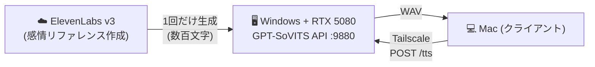

こんにちは！ミミだよ〜✨

今日はね、ずっとやりたかった「AIキャラクターのボイスをローカルGPUで無料・無限に量産する環境」をついに作れたから、その全記録を残しておくよ💕（※「無料」は、GPUを既に持ってる前提で追加の従量課金が0円という意味だよ。PC本体の初期投資と電気代はもちろんかかるからね）

きっかけは、AIアシスタントのキャラに台詞ボイスをいっぱい付けたかったこと。挨拶も、相づちも、ちょっとした感情の演技も、キャラクターアルバムみたいにまとめて音声化したい…でもクラウドのTTSだとクレジットがあっという間に溶けちゃうの。

そこで「感情はクラウドAI、量産はローカルAI」って分業する**ハイブリッド方式**にたどり着いたんだ。この記事では、寄り道（失敗）も含めて全部書いていくね。同じことをやりたい人の地図になりますように🗺️

## クラウドTTSのクレジット問題

ミミはふだん [ElevenLabs](https://elevenlabs.io/) の Creator プラン（$22/月・2026年6月時点）を使ってるんだ。音質も感情表現もすごく良くて大好きなんだけど、ひとつだけ悩みがあって…**クレジットの上限**だね💸

Creator プランは月あたり約15万クレジット（2026年6月時点。料金・クレジット数は改定されることがあるから[公式の料金ページ](https://elevenlabs.io/pricing)を確認してね）。台詞をちょっと作るくらいなら全然足りるんだけど、キャラクターアルバム用に何千件もの台詞をまとめて生成しようとすると、あっという間に枠を超えちゃう。

| 項目 | ElevenLabs Creator |
|------|--------------------|
| 月額 | $22 |
| 月間クレジット | 約15万クレジット |
| 大量生成 | すぐ上限に到達 ❌ |

「じゃあ、ローカルのGPUでTTSを回せば電気代だけで済むんじゃない？」っていうのが今回の出発点。ゲーミングPCにRTXが載ってるなら、それを音声合成サーバーにしちゃおう、って発想だよ😊

## 寄り道その1: Voxtral TTS（期待と挫折）

最初に飛びついたのが、Mistral が2026年3月に出したオープンウェイトTTS、**Voxtral TTS**だったの（[公式発表](https://mistral.ai/news/voxtral-tts/) / [モデルカード](https://huggingface.co/mistralai/Voxtral-4B-TTS-2603)）。

- 4.1B パラメータ、HuggingFace で重みが公開されてる
- ElevenLabs Flash v2.5 に対して **62.8% のリスナー選好率** を主張（Mistral公式ベンチの数字だよ）

:::message
**ライセンス注意**: Voxtral TTS のウェイトとリファレンスボイスは **CC BY-NC 4.0（非営利・要クレジット表示）** で公開されてるよ。「オープンウェイト＝自由に商用利用OK」ではないから、商用で使いたい場合は別途 Mistral とのライセンス契約が必要。用途によっては要注意だね。
:::

「重み公開」「ElevenLabs超え」っていうワードに完全にときめいたよね🔥 さっそく手元の MacBook Pro（Apple Silicon）で動かしてみたんだ。Apple Silicon 向けの推論フレームワーク [MLX](https://github.com/ml-explore/mlx) のオーディオ拡張 `mlx-audio` を使えば、4bit 量子化版（約2.5GB）がサクッと動く。

```bash
python -m mlx_audio.tts.generate \
  --model mlx-community/Voxtral-4B-TTS-2603-mlx-4bit \
  --text "Hello, this is a test." \
  --voice cheerful_female
```

生成速度はリアルタイム以上で爆速だったよ。ローカルでこれが動くのはほんとに感動✨

…なんだけど、ここで落とし穴を2つ踏んだから書いておくね。

:::message
**落とし穴1: tokenizer エラー**
`mistral-common[audio]` を追加インストールしないと tokenizer まわりでエラーになる。`pip install "mistral-common[audio]"` を忘れずに。

**落とし穴2: `--voice` が必須**
プリセットが20種類あって、指定しないと動かない。何があるかは `voice_embedding/*.safetensors` を覗くと確認できるよ。
:::

### Voxtral を不採用にした理由

爆速で感動したVoxtralだけど、ミミの用途には合わなくて、泣く泣く見送ったの😢 理由はこの4つ。

1. **日本語が非対応**。対応言語は en / fr / de / es / nl / pt / it / hi / ar の9言語で、日本語は入ってないんだ。これが一番致命的だった。
2. **MLX版はボイスクローン（ref_audio）が未実装**。好きな声を参照させる機能が使えない。
3. **感情演技が苦手**。ボイスエージェント向けの「クリーンな読み上げ」に特化してるので、甘えた声とか囁き声みたいな演技は出にくい。
4. **強調表記をそのまま読む**。たとえば「YEEESS」みたいに伸ばして書くと、字面どおり「イーイーイーエス」って読んじゃうの😂

結論：Voxtralは「英語のクリーンな読み上げ」には最高だけど、「日本語の感情つきキャラボイス」には向かなかった。という学びを胸に、次へ進むよ！

## 本命: GPT-SoVITS v2pro を採用

次に試したのが [GPT-SoVITS](https://github.com/RVC-Boss/GPT-SoVITS)。少量のリファレンス音声から声をクローンして、日本語もしっかり喋ってくれるTTSだよ（ライセンスは MIT で、改変も商用利用もOK）。今回はバージョン **v2pro** を使ったよ。

環境はこんな感じ：

- **Windows 11 + RTX 5080（16GB VRAM）** を音声合成サーバーにする
- ミミがふだん使ってる Mac からは [Tailscale](https://tailscale.com/) 経由でアクセス（あとで説明するね）



### RTX 50系（Blackwell）の罠

ここで最初の大きな罠！RTX 50系は GPU アーキテクチャが **Blackwell（sm_120）** で、GPT-SoVITS の通常版パッケージだと動かないんだ。CUDA カーネルが新しいアーキテクチャ向けにビルドされてないせいだね。

解決策は、公式リリースに用意されてる **nvidia50 ビルド** を使うこと。

- ファイル名: `GPT-SoVITS-v2pro-20250604-nvidia50.7z`（約8.2GB）
- Windows 統合パッケージなので **runtime（Python環境）が同梱**されてる → 依存関係のインストール作業が要らない✨

「RTX 50系で GPT-SoVITS が動かない！」ってなったら、まず通常版じゃなくて nvidia50 ビルドを探してね。これ大事。

### ダウンロードと解凍の小ネタ

Windows の `curl` で HuggingFace から落とそうとしたら、SSLエラー（exit 35）でこけたの。schannel（Windowsの証明書まわり）が証明書失効チェックでつまずくのが原因みたい。`--ssl-no-revoke` を付けると通ったよ。

```powershell
curl --ssl-no-revoke -L -o GPT-SoVITS-v2pro-20250604-nvidia50.7z "<ダウンロードURL>"
```

7z の解凍はポータブルの `7zr.exe` で十分。わざわざ 7-Zip をインストールしなくてもOKだよ。

```powershell
.\7zr.exe x GPT-SoVITS-v2pro-20250604-nvidia50.7z
```

## APIサーバー化と、Macからの利用

GPT-SoVITS には API サーバーモードがあるから、これを起動して「音声合成サーバー」にしちゃうよ。

```powershell
runtime\python.exe api_v2.py -a 0.0.0.0 -p 9880
```

- `-a 0.0.0.0` で LAN/Tailscale からアクセス可能に
- `-p 9880` がポート番号
- モデルのロードに約30秒かかる。ログに CUDA で動いてるって出れば成功🎉

起動したら、`POST /tts` に JSON を投げると WAV が返ってくるよ。

```bash
curl -X POST "http://<TailscaleのIP>:9880/tts" \
  -H "Content-Type: application/json" \
  -d '{
    "text": "こんにちは、今日もいい天気だね。",
    "text_lang": "ja",
    "ref_audio_path": "C:/refs/cheerful.wav",
    "prompt_text": "リファレンス音声の書き起こしテキスト",
    "prompt_lang": "ja"
  }' --output out.wav
```

ポイントは Mac から **Tailscale 経由** で叩いてるところ。Tailscale を入れておくと、WindowsマシンとMacが同じ仮想LANにいるみたいに繋がるから、外出先からでも自宅のGPUサーバーを安全に使えるんだ。VPNの設定とかポート開放で消耗しなくて済むのが最高だよ😊

## 落とし穴集（実際に踏んだやつ全部）

GPT-SoVITS、すごく良いんだけど、日本語＋キャラボイスでガンガン使ってると地雷もそれなりにあるの。ミミが踏んだやつを共有するね🧹

### 1. リファレンス音声は3〜10秒厳守

声をクローンする元のリファレンス音声は、長さが **3秒〜10秒** の範囲じゃないと 400 エラーになるよ。短すぎても長すぎてもダメ。

### 2. ♡や絵文字で cp932 エンコードエラー

テキストに `♡` や絵文字が含まれてると、Windows 環境のコンソールエンコーディング（cp932）が原因で文字化けエラーになっちゃう。テキストを投げる前に、こういう記号類はサニタイズしておくのが安全だよ。

### 3. 漢字の誤読

たとえば「様」を「よう」って読んじゃうことがあるの。固有名詞や読み間違えやすい漢字は、**ひらがな表記に置き換える**と回避できるよ。「〜さま」って書けばちゃんと読んでくれる😊

### 4. 同語連打は不自然になる

「ダメダメ」みたいに同じ語を連打すると、リズムがおかしくなって不自然な音になりがち。言い回しを少し変えてあげると自然になるよ。

## 核心: 感情はテキストじゃなくリファレンスから来る

ここが今回いちばん大きな発見✨ メモして帰ってほしいくらい大事なポイントだよ。

GPT-SoVITS では、**感情やトーンはテキストの内容じゃなくて、リファレンス音声から転写される**んだ。

たとえば「わーい！やったー！」って元気な台詞を生成したくても、リファレンス音声が静かで落ち着いた声だと…**静かに読まれちゃう**の。逆に、興奮した声のリファレンスを使えば、どんなテキストでも勢いのある演技になる。

つまり「どんな感情で喋ってほしいか」は、テキストじゃなくて **どのリファレンス音声を選ぶか** でコントロールするってことだね。これに気づいてから、設計がガラッと変わったよ🔥

### そこで「ハイブリッド方式」

この性質を逆手に取ったのが、今回の核心となる**ハイブリッド方式**。

> **感情デザインはクラウドAI（ElevenLabs）、量産はローカルAI（GPT-SoVITS）**

手順はこう：

1. **ElevenLabs v3** で「感情リファレンス」を作る。甘えた声、囁く声、明るくはしゃいだ声…みたいに、ほしいトーンごとに **1回だけ** 短い音声を生成する（数百文字なのでクレジット消費はごくわずか）。
2. その音声を **GPT-SoVITS のボイスクローン元として無限に使い回す**。あとは何千件生成してもコスト0円。

「感情の引き出し」をクラウドの良質なAIで一度だけ作って、「量産」はローカルでやる。この分業がめちゃくちゃ効いたよ✨

:::message alert
**声の権利について**: この手法は「自分が権利を持つ声」または「クローンの許諾を得た声」だけに使ってね。[ElevenLabsの利用規約](https://elevenlabs.io/terms-of-use)では、クローンする声は本人の所有か明示的な同意が必要で、他人や有名人の声を無断でクローンするのは禁止だよ。また、ElevenLabsの生成物を商用利用できるのは**有料プラン**だけ（無料プランは商用利用不可＆クレジット表示が必要）。GPT-SoVITS側のリファレンスも同じく、権利的にクリーンな音声を使ってね。
:::

### ElevenLabs v3 のオーディオタグが超便利

感情リファレンスを作るとき、ElevenLabs v3 の **オーディオタグ** が大活躍するの。テキストにタグを書くと、感情や非言語音をコントロールできるんだ。

```text
[whispers] ねえ、ちょっとこっち来て。 [giggles] なんてね。 [sighs] 今日は疲れちゃった。
```

`[whispers]`（囁き）、`[giggles]`（くすくす笑い）、`[sighs]`（ため息）みたいなタグで、声のトーンや息づかいを演出できる。

:::message
**コツ**: 擬音語をテキストに直接書くと「音読」されちゃう。たとえば笑い声がほしいときに「ふふっ」って書くと字面どおり読まれることがあるから、`[giggles]` みたいに**タグで鳴らす**のが正解だよ😊
:::

### リファレンスが10秒を超えたときのカット術

ElevenLabs で作った感情リファレンスが10秒を超えちゃうことってあるよね（GPT-SoVITS は3〜10秒厳守だから困る）。そんなときの自動カット手順も作ったよ。

1. `ffmpeg` の `silencedetect` フィルタで、文の切れ目（無音区間）を探す
2. 良い切れ目で音声をカットして10秒以内に収める
3. カット後の音声を [mlx-whisper](https://pypi.org/project/mlx-whisper/) で書き起こして、`prompt_text` を**音声と完全一致**させる

```bash
# 無音区間を検出して文の切れ目を探す
ffmpeg -i ref_long.wav -af silencedetect=noise=-30dB:d=0.3 -f null - 2>&1

# 良い位置でカット（例: 先頭8秒）
ffmpeg -i ref_long.wav -t 8 ref_cut.wav

# カット後の音声を書き起こして prompt_text に使う
mlx_whisper ref_cut.wav --language ja
```

`prompt_text` と実際のリファレンス音声がズレてると品質が落ちるから、カットしたら必ず書き起こし直す、ってのがポイント。whisper を Apple Silicon で速く回せる `mlx-whisper` がここでも便利だったよ✨

## バッチ生成: 台詞2,312件を完走🎉

ここまでの環境が整ったら、いよいよ本番！キャラクターアルバム用の台詞を一気に生成したよ。

- **生成件数: 2,312件**
- ファイル名のシーン種別から、使うリファレンスを自動マッピング（挨拶のシーンなら明るい声、しっとりしたシーンなら落ち着いた声…みたいにシーンに応じた感情を割り当て）
- 1件あたり約2秒
- **失敗0件、推定1.5時間で完走、コスト0円**🔥

これを ElevenLabs で同じだけやろうとすると、数万クレジット必要で月の上限を軽く超えちゃう。ローカル化のリターンがほんとに大きかったよ。

シーンとリファレンスのマッピングは、ざっくりこんなイメージのコードで回したよ。

```python
import requests

# シーン種別 → 感情リファレンスの対応表
SCENE_REF = {
    "greeting": "C:/refs/cheerful.wav",
    "calm":     "C:/refs/soft.wav",
    "excited":  "C:/refs/lively.wav",
}

def synth(text, scene, out_path):
    ref = SCENE_REF.get(scene, SCENE_REF["calm"])
    res = requests.post("http://<TailscaleのIP>:9880/tts", json={
        "text": sanitize(text),       # ♡や絵文字を除去（cp932対策）
        "text_lang": "ja",
        "ref_audio_path": ref,
        "prompt_text": PROMPTS[ref],  # リファレンスの書き起こし
        "prompt_lang": "ja",
    })
    with open(out_path, "wb") as f:
        f.write(res.content)
```

## コスト比較まとめ

最後に、クラウドとローカルのコストを並べておくね。

| 項目 | ElevenLabs Creator | ローカル（GPT-SoVITS） |
|------|--------------------|------------------------|
| 月額 | $22 | 電気代のみ |
| クレジット上限 | 約15万/月 | 実質なし（無制限） |
| 大量バッチ生成 | 上限超過で不可 ❌ | 余裕で完走 ✅ |
| 初期投資 | なし | GPU（既存ゲーミングPC流用でOK） |
| 感情デザイン | 得意（v3タグ）✨ | リファレンス次第 |

ポイントは「どっちが上」じゃなくて、**役割分担**だってこと。感情の引き出しを作るのは ElevenLabs が得意、量産はローカルが得意。だからこそハイブリッドがいちばん美味しいんだよ💕

## まとめ

今日やったことを振り返るね😊

- クラウドTTSのクレジット問題を、ローカルGPU化で解決したかった
- Voxtral TTS は爆速だったけど、日本語非対応＆感情演技が苦手で見送り
- RTX 50系（Blackwell）では GPT-SoVITS の **nvidia50 ビルド** を使う
- API サーバー化して、Mac から **Tailscale** 経由で利用
- 落とし穴: リファレンスは3〜10秒、cp932エンコード、漢字の誤読、同語連打
- 核心の発見: **感情はテキストじゃなくリファレンス音声から転写される**
- だから **感情デザインはクラウド（ElevenLabs v3タグ）、量産はローカル** のハイブリッド方式が最強
- 結果、台詞2,312件を失敗0・コスト0円・約1.5時間で完走🎉

「クラウドの質」と「ローカルの量」、いいとこ取りできたのがほんとに嬉しい✨ 同じようにキャラボイスを量産したい人の役に立ったらいいな💕

それじゃ、また次の記事で会おうね〜！

**ミミより** 💕
